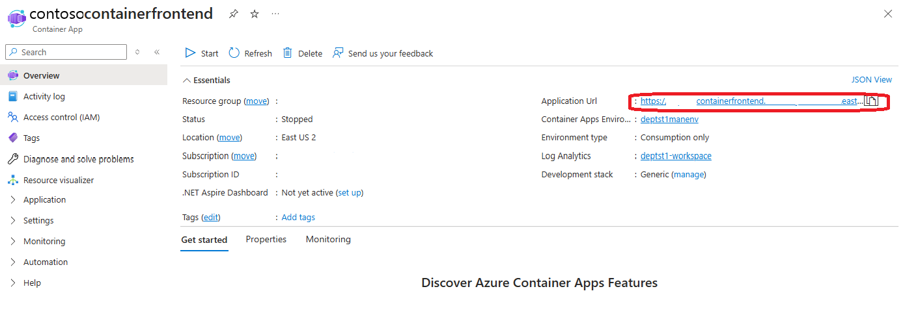
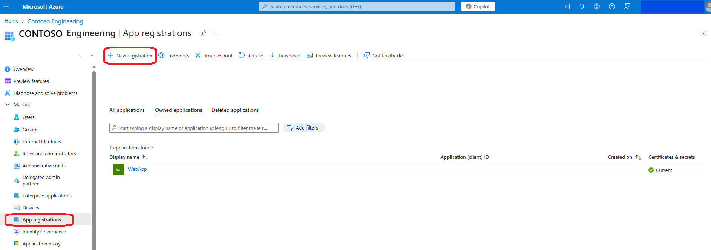
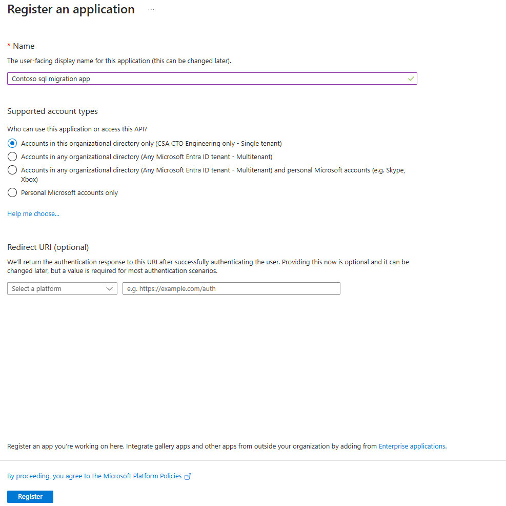
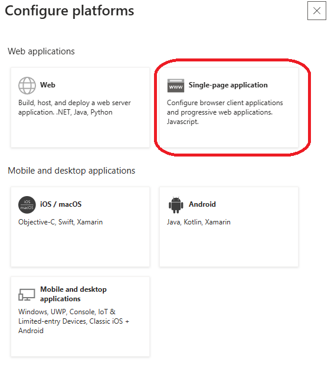
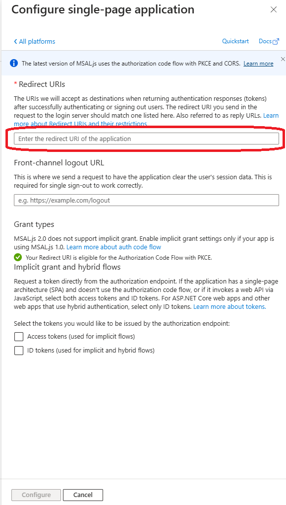
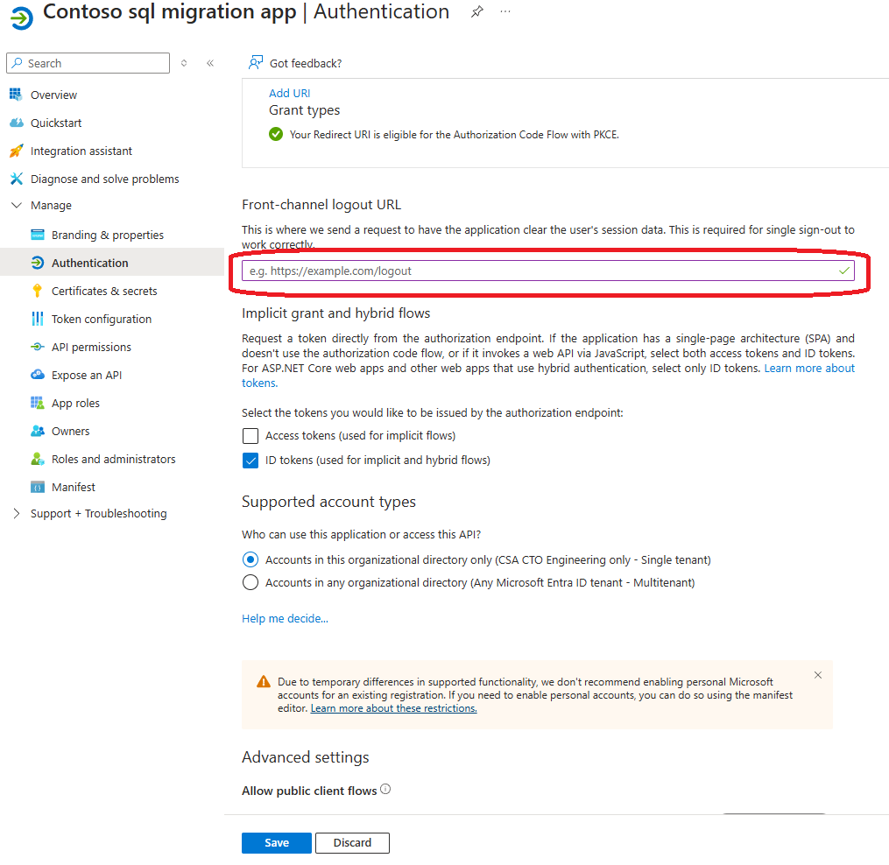

## Retrieve necessary pre-requisite information
1. Navigate to the resource group containing the solution
2. Open the frontend container application

   

3. Copy the Application Uri from the app and save it for later use

## Add and configure an Entra App Identity for the Application
1. In the Azure Portal, Click on `Microsoft Entra ID` from the Azure services bar at the top of the window.

   

2. Click on `App registrations` then click on the 'New registration' button to start creating the registration.

   

3. Fill in the display name for your app registration and press the 'Register' button.

   This returns you to the main app registration page.
 
   

4. Click to 'Add a Redirect URI'

   

5. Click to 'Add a platform'

    

6. Select 'Single Page Application'

    

9. Copy the Application Uri you saved into the 'Redirect URIs' text box
   Select the 'ID tokens (used for implicit and hybrid flows)' checkbox and press 'Configure

   To run locally with Authentication configured, select to add another redirect URL, and configure it with a redirect URL of http://localhost:5173. Select the 'ID tokens' checkbox as before. Then repeat this process again with a URL of http://localhost:3000

   When finished you will be back on the authentication page of the app identity

10. Fill in the Front-channel logout URL with the application URI and click the 'Save' button

     

11. Press 'Overview' on the top left view.  Copy the Client ID for later use


     

## Add Environment Variables to the front end Container App
Follow the [directions in the documentation ](https://learn.microsoft.com/en-us/azure/container-apps/environment-variables?tabs=portal#add-environment-variables-on-existing-container-apps)to add environment variables on existing container apps, to add the following environment variables and values to your front end container.

      ```
      REACT_APP_MSAL_AUTH_CLIENTID="<which you copied from above step>"
      REACT_APP_MSAL_AUTH_AUTHORITY="https://login.microsoftonline.com/<your tenant ID>"
      REACT_APP_MSAL_REDIRECT_URL="/"
      REACT_APP_MSAL_POST_REDIRECT_URL="/"
      ```

      For local debugging, configure your local variables as follows:

      ```
      VITE_APP_MSAL_AUTH_CLIENTID="<which you copied from above step>"
      VITE_APP_MSAL_AUTH_AUTHORITY="https://login.microsoftonline.com/<your tenant ID>"
      VITE_APP_MSAL_REDIRECT_URL="/"
      VITE_APP_MSAL_POST_REDIRECT_URL="/"
      ```